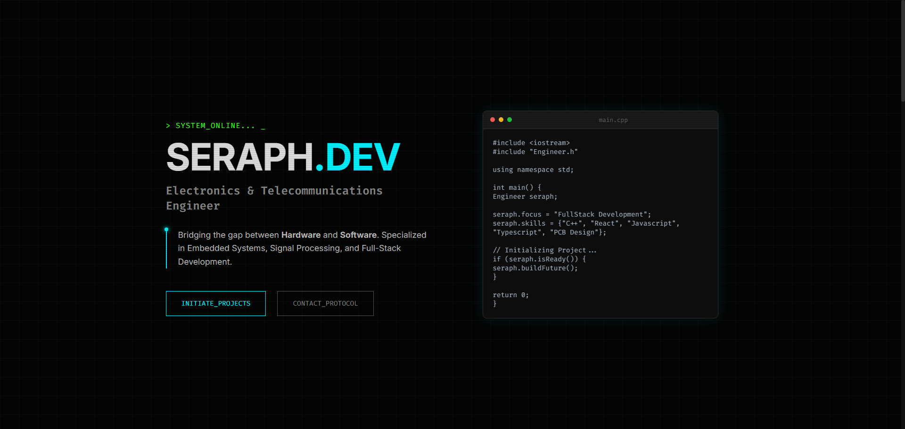

<div align="center">

  <h1>&gt; SYSTEM_ONLINE: SERAPH.DEV</h1>

  <p>
    <strong>Electronics & Telecommunications Engineer Portfolio</strong><br>
    <i>Bridging the gap between Hardware and Software through a futuristic interface.</i>
  </p>

  <p>
    <a href="https://owaseraph.github.io/portfolio/"><strong>[ INITIATE_LIVE_DEMO ]</strong></a>
  </p>

  
  
  
  

</div>

<br />

## 🖥️ System Overview

This is a personal portfolio website built to reflect the precision and technical nature of **Electronics & Telecommunications Engineering (ETTI)**. 

Unlike standard portfolios, this project treats the user interface as a **System Terminal**, featuring a split-screen layout, automated diagnostic loops, and command-line interactions. It creates an immersive experience that highlights both **Full-Stack Development** skills and an **Engineering mindset**.



## ⚙️ Core Modules (Features)

* **🚀 System Boot Sequence:** Uses `framer-motion` to stagger-load elements, mimicking a terminal startup.
* **💻 Split-Terminal Layout:** A responsive grid system featuring a bio on the left and a live C++ code typing simulation on the right.
* **🔄 Auto-Scroll Diagnostic Loop:** A custom hook that automatically cycles the user between "LOADED_DRIVERS" (Skills) and "DEPLOYED_MODULES" (Projects) every 10 seconds.
* **📟 Hardware/Software Categorization:** Skills are logically grouped to show proficiency in both high-level web apps and low-level embedded systems.
* **📡 Terminal Contact Form:** Integrated with **Formspree**, this AJAX form handles submissions without a backend, providing a "Transmission Received" success state.
* **📺 Visual FX:** Custom CSS implementations of CRT Scanlines, RGB Text Glitching, and PCB Trace styling.

## 🛠️ Tech Stack (The Arsenal)

**Frontend Architecture:**
* **React.js** (Functional Components & Hooks)
* **Framer Motion** (Complex Animations & Transitions)
* **React Type Animation** (Terminal Typing Effects)

**Styling & UI:**
* **Custom CSS3** (Variables, Keyframe Animations, Flexbox/Grid)
* **Fira Code Font** (Ligatures for coding aesthetics)

**Deployment & Utils:**
* **GitHub Pages** (Hosting)
* **Formspree** (Email API)

## 📂 File Structure

A clean, component-based architecture designed for scalability.

```text
src/
├── components/
│   ├── CodeTerminal.js   // The right-side C++ typing animation
│   ├── Contact.js        // Formspree integration & terminal form
│   ├── Projects.js       // Data-driven project cards
│   ├── Skills.js         // Hardware/Software skill grids
│   └── SystemTimer.js    // The 10s loading bar component
├── data/
│   ├── projects.js       // JSON data for portfolio items
│   └── skills.js         // JSON data for tech stack
├── App.js                // Main layout & Scroll Logic
├── App.css               // Cyberpunk/CRT styling
└── index.js              // Entry point & Router
```

## ⚡ Initialization Protocol (Run Locally)

If you wish to run this system on your local machine:

# 1. **Clone the repository**

```bash
git clone [https://github.com/owaseraph/portfolio.git](https://github.com/owaseraph/portfolio.git)
cd portfolio
```
# 2. **Install Dependencies**

```bash
npm install
```

# 3. **Start Local Server**
```bash
npm start
```

The application will launch at `http://localhost:3000`.

## 🚀 Deployment Protocol

This system is configured for **GitHub Pages**.

# 1. **Build the Production Bundle**
```bash
npm run build
```
# 2. **Deploy to gh-pages branch**
```bash
npm run deploy
```


