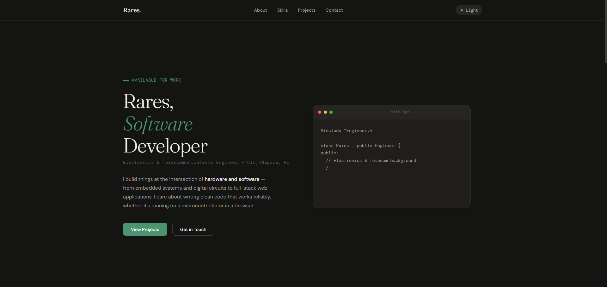

# Electronics & Telecommunications Engineer Portfolio

Live Demo: [owaseraph.github.io/portfolio](https://owaseraph.github.io/portfolio/)

---


## Overview

This portfolio showcases my work as an Electronics & Telecommunications Engineering student, with a focus on both hardware and software. The site features a modern, responsive design, interactive terminal-inspired UI, and highlights projects that bridge embedded systems and web development.




## Features

- Split-terminal layout with animated code simulation
- Project and skills auto-scroll
- Hardware/software skill grouping
- Responsive, theme-switching UI
- Formspree-powered contact form
- CRT/glitch visual effects


## Tech Stack

- React.js
- Framer Motion
- CSS3
- GitHub Pages (deployment)
- Formspree (contact form)


## Main Projects

- **RLE Compression Tool**: Full-stack web app (Django + React) for run-length encoding/decoding, with authentication and history. [Repo](https://github.com/owaseraph/RLE_Fullstack_Tool) | [Live](http://owaseraph.pythonanywhere.com)
- **Digital Circuit Simulator**: Real-time logic circuit simulator in C++ (SDL3, ImGui). [Repo](https://github.com/owaseraph/Digital-Logic-Simulator)
- **This Portfolio**: React + Framer Motion, responsive, animated, and hosted on GitHub Pages. [Repo](https://github.com/owaseraph/portfolio) | [Live](https://owaseraph.github.io/portfolio/)


## Getting Started

1. **Clone the repository**
  ```bash
  git clone https://github.com/owaseraph/portfolio.git
  cd portfolio
  ```
2. **Install dependencies**
  ```bash
  npm install
  ```
3. **Start the development server**
  ```bash
  npm start
  ```
  The app runs at [http://localhost:3000](http://localhost:3000)

## Deployment

Build and deploy to GitHub Pages:
```bash
npm run build
npm run deploy
```


## Skills

- **Languages:** C/C++, Java, JavaScript, Python
- **Web:** React.js, Django, HTML5, CSS3, REST APIs
- **Hardware/Embedded:** Arduino, Microcontrollers, I²C/SPI, Signal Processing, LTSpice
- **Tools:** Git/GitHub, Docker, VS Code, CMake, Linux

---

**Contact:**
- [GitHub](https://github.com/owaseraph)
- [LinkedIn](https://linkedin.com/in/yourprofile)
- Email: tcaciuc.rares.stefan@gmail.com


